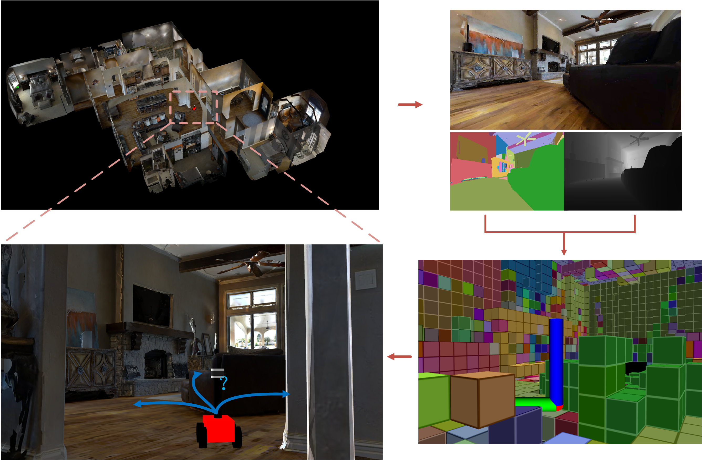
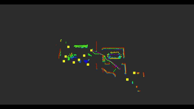
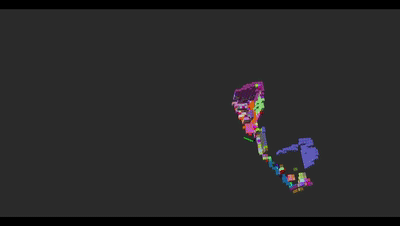

# Active Semantic Mapping and Pose Graph Spectral Analysis for Robot Exploration [IROS 2024]

<p align = "center">   
  
</p>

### Detected dependencies:
- ROS Noetic
- OctoMap
- PCL
- Eigen
- OpenCV
- Python3

```
catkin config --install
catkin build
source install/setup.bash
roslaunch orb_slam2_ros orb_slam2_exploration.launch # localization
python3 odom_transfer.py # only for transforming the ROS Msg format
roslaunch semantic_octomap semantic_mapping.launch # mapping
roslaunch semantic_exploration run_semantic_exploration.launch # planning
```

<p align="center">
  
  
</p>

## Citation
Preprint coming soon.
## Acknowledgments
- [SSMI](https://ieeexplore.ieee.org/abstract/document/10057106)
- [Explorb](https://ieeexplore.ieee.org/abstract/document/10003990)
- [ORB-SLAM](https://ieeexplore.ieee.org/document/7946260)
- [Semantic mapping](https://github.com/floatlazer/semantic_slam)
## License
[](https://choosealicense.com/licenses/mit/)
## Contributors
<a href="https://github.com/BohemianRhapsodyz/semantic_exploration/graphs/contributors">
  
</a>  

****

